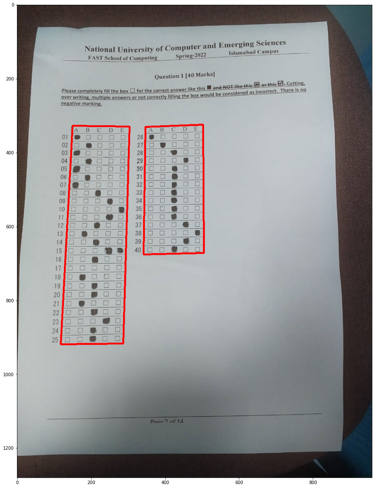
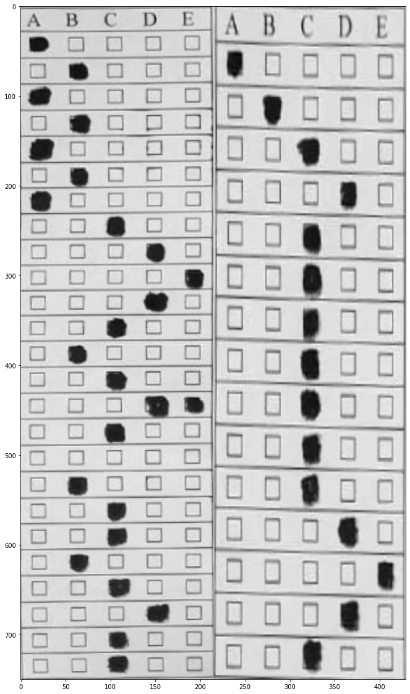
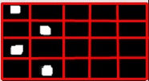

This project leverages the power of computer vision to help teachers grade multiple choice exams quickly and accurately. Teachers can scan the answer sheets, upload the solution and the system will automatically grade the exams and provide a detailed report of the results. This project is a perfect solution for teachers who are looking to save time and effort while grading exams.

## How it Works
- The image is converted to grayscale and then Gaussian blur is applied to remove noise
- The image is then cropped to the area of interest through contour detection
- The image is then converted to binary using adaptive thresholding
- The image is then opened (Erosion followed by Dilation) to remove noise
- The image is then divided into cells
- The cells are then checked for white pixels
- A cell is considered marked if the number of white pixels is greater than a set threshold
- A question is considered unmarked if there are no marked options or more than one option are marked in the same row
- The marked options are then compared with the correct answers to calculate the score

## Demo 
||
|:--:|
|*Contour Detection*|

||
|:--:|
|*Transformed Image*|

||
|:--:|
|*Binary Image*|

||
|:--:|
|*Image Cells*|

## How to Use
||
|:--:|
|*Create Exam*|

||
|:--:|
|*Exam Name*|

||
|:--:|
|*Upload Solution*|

||
|:--:|
|*Upload Answers*|

||
|:--:|
|*Exam Details*|

||
|:--:|
|*All Exams*|

## Individual Exam Actions:
You can now perform the following actions:
- **Upload a New Solution:** Click on Upload Solution to provide a new Solution
- **Generate Report:** If you uploaded a new solution, you can click generate
report and it will generate an uploaded report
- **Upload New Image to Score:** You can upload more images by clicking on
the Upload an Image Button and Then generate a new Report to Score them.
- **Download CSV:** You can download the CSV File of the report.

## Collaborators
- [Hamza Iftikhar](https://github.com/Ham-Ifti)
- [Hamza Khalid](https://github.com/hmzakhalid)